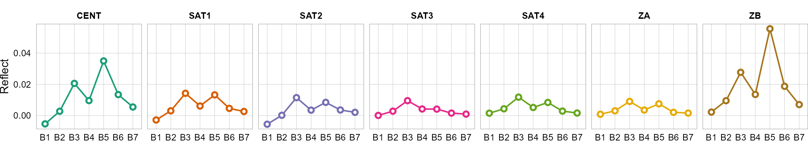

<!-- TODO: acomodar los nros de secciones con la intro -->
<!-- TODO: sistemas de coordenadas -->
<!-- TODO: pongo las tablas dentro de echo: false y uso {gt} -->

```{r}
#| echo: false
knitr::opts_chunk$set(dev.args = list(bg = "transparent"))
```

La estimación de parámetros del agua (turbidez, clorofila-a, profundidad de disco, etc) es posible mediante técnicas de teledetección. Se combinan las reflectancias de superficie (obtenidas por plataformas satelitales) con mediciones de propiedades de interés (mediante muestreos de campo) para dar paso a la modelización, obteniendo un algoritmo.

El área de estudio es el Lago San Roque y el producto satelital proviene de Landsat 8 para la fecha 2017-02-22.

# Paquetes

Los paquetes requeridos son `{terra}` para el procesamiento de datos espaciales (rásters y vectores) y `{tidyverse}` para el procesamiento general de datos. El paquete `{tidyterra}` nos es útil para la confección de mapas.

```{r}
#| warning: false
#| output: false
library(terra)
library(tidyverse)
library(tidyterra)
```

# Datos

Se detectan los archivos raster para su lectura, creando un ráster multibanda con los nombes adecuados. 

```{r}
l <- list.files("tp_clorofila/rasters/", full.names = TRUE, pattern = "_SR_B")
r_lista <- map(l, rast)
bandas <- paste0("B", 1:7)
r_lista <- setNames(r_lista, bandas)
r_completo <- rast(r_lista)
```

Luego, se lee el vector del Lago San Roque para usarlo en el recorte del ráster, conservando únicamente la extensión del cuerpo de agua.

```{r}
v <- vect("tp_clorofila/vectores/san_roque.geojson")
r_recorte <- crop(r_completo, v)
```

Finalmente, se convierten los valores de píxel (que se encuentran como números digitales) a reflectancias de superficie.

```{r}
r <- 2.75e-05 * r_recorte - 0.2
```

Se lee el vector de los puntos de muestreo y se visualizan todo en la siguiente figura RGB.

```{r}
p <- vect("tp_clorofila/vectores/puntos.geojson")
```

A partir de una visualización se verifica lo realizado.

```{r}
#| label: fig-rgb
#| fig-cap: Mapa RGB del Lago San Roque
#| fig-cap-location: margin
#| column: body-outset
ggplot() +
  geom_spatraster_rgb(
    data = r,
    r = 4,
    g = 3,
    b = 2,
    stretch = "lin",
    interpolate = FALSE
  ) +
  geom_spatvector(data = p, shape = 21, fill = "red", color = "gold") +
  geom_spatvector_label(
    data = p,
    aes(label = sitio),
    size = 3,
    vjust = -.25,
    border.color = NA,
    fill = "white"
  ) +
  labs(title = "2022-02-17") +
  coord_sf(expand = FALSE) +
  theme_void()
```

Dado que el sitio `GAR` se encuentra en una región estrecha del Lago (@fig-rgb), se lo remueve y no será considerado en la etapa de modelización.

```{r}
p <- p[p$sitio != "GAR"]
```

Los datos de clorofila-a registran la fecha, el nombre del sitio y la medición de clorofila-a de las muestras de agua, en μg/l.

```{r}
#| warning: false
#| label: tbl-clo
#| tbl-cap: Datos de muestreo de clorofila-a por sitio.
#| tbl-cap-location: margin
clo_tbl <- read_csv2("tp_clorofila/datos/clorofila.csv") |>
  rename(fecha = Fecha, sitio = Nombre_Sitio, clo = `cloroa (ug/L)`) |>
  mutate(fecha = dmy(fecha))
```

```{r}
#| echo: false
gt::gt(clo_tbl)
```

A partir de los sitios de muestreo se extraen las reflectancias de superficie.

```{r}
#| tbl-cap: Reflectancias de superficie extraidas de los sitios de muestreo
#| tbl-cap-location: margin
#| label: tbl-reflect
reflect_tbl <- terra::extract(r, p, bind = TRUE) |>
  as_tibble() |>
  select(sitio, starts_with("B"))
```

```{r}
#| echo: false
gt::gt(reflect_tbl) |>
  gt::fmt_number(decimals = 4)
```

Se combinan los datos espectrales con las mediciones de clorofila-a, empleando el nombre del sitio.

```{r}
reflect_clo <- reflect_tbl |>
  pivot_longer(cols = -sitio, values_to = "reflect", names_to = "banda") |>
  inner_join(clo_tbl, by = join_by(sitio)) |>
  mutate(banda = fct(banda))
```

```{r}
#| echo: false
gt::gt(head(reflect_clo, 14)) |>
  gt::fmt_number(decimals = 5, columns = "reflect")
```

# Firma espectral

A partir de las reflectancias de superficie se grafican las firmas espectrales por cada sitio, para identificar. Primeramente se reacomodan los datos facilitando crear figuras.

```{r}
#| fig-cap-location: margin 
#| label: fig-firma
#| eval: false
ggplot(reflect_clo, aes(banda, reflect, group = sitio, color = sitio)) +
  geom_line(show.legend = FALSE, linewidth = .5) +
  geom_point(show.legend = FALSE, shape = 21, fill = "white", stroke = 1) +
  facet_wrap(facets = vars(sitio), scales = "fixed", nrow = 1, axes = "all_x") +
  scale_color_brewer(palette = "Dark2") +
  labs(x = NULL, y = "Reflect") +
  theme_minimal(base_size = 10) +
  theme(aspect.ratio = 1) +
  theme_sub_axis(text = element_text(color = "black")) +
  theme_sub_panel(
    grid.minor = element_blank(),
    grid.major = element_line(linewidth = .1, color = "grey"),
    border = element_rect(color = "black", linewidth = .1)
  ) +
  theme_sub_strip(text = element_text(color = "black", face = "bold")) +
  theme_sub_plot(background = element_blank(), margin = margin())
```

```{r}
#| echo: false
g <- ggplot(reflect_clo, aes(banda, reflect, group = sitio, color = sitio)) +
  geom_line(show.legend = FALSE, linewidth = .5) +
  geom_point(show.legend = FALSE, shape = 21, fill = "white", stroke = 1) +
  facet_wrap(facets = vars(sitio), scales = "fixed", nrow = 1, axes = "all_x") +
  scale_color_brewer(palette = "Dark2") +
  labs(x = NULL, y = "Reflect") +
  theme_minimal(base_size = 8) +
  theme(aspect.ratio = 1) +
  theme_sub_axis(text = element_text(color = "black")) +
  theme_sub_panel(
    grid.minor = element_blank(),
    grid.major = element_line(linewidth = .1, color = "grey"),
    border = element_rect(color = "black", linewidth = .1)
  ) +
  theme_sub_strip(text = element_text(color = "black", face = "bold")) +
  theme_sub_plot(background = element_blank(), margin = margin())

ggsave(
  plot = g,
  filename = "tp_clorofila/fig/firma_espectral.png",
  width = 20,
  height = 3.7,
  units = "cm"
)
```

::: {.column-page}
{#fig-firma-espectral}
:::

# Correlación clorofila-a y bandas espectrales

A partir de los valores de reflectancia de superficie asociados a las mediciones de clorofila-a, se puede calcular el coeficiente de correlación lineal (`r`) de cada banda.

```{r}
#| tbl-cap: Coeficientes de correlación lineal entre clorofila-a y las bandas L8
#| tbl-cap-location: margin
#| label: tbl-corr
corr <- reflect_clo |>
  nest(.by = banda) |>
  mutate(r = map_dbl(data, ~ cor(.x$reflect, .x$clo))) |>
  select(banda, r) |>
  arrange(desc(r))
```

```{r}
#| echo: false
gt::gt(corr) |>
  gt::fmt_number(decimals = 3)
```

# Modelización

A partir de los valores de $r$, se selecciona la banda `B5` para crear un modelo de regresión.

```{r}
m <- reflect_clo |>
  pivot_wider(
    names_from = banda,
    values_from = reflect,
    id_cols = c(sitio, clo)
  ) |>
  lm(clo ~ B5, data = _)

broom::tidy(m) |>
  select(term, estimate, p.value) |>
  knitr::kable(digits = 3)

broom::glance(m) |>
  select(r.squared, p.value) |>
  knitr::kable(digits = 3)
```

```{r}
#| echo: false
ordenada <- broom::tidy(m)$estimate[1] |> round(2)
pendiente <- broom::tidy(m)$estimate[2] |> round()
r2 <- broom::glance(m)$r.squared |> round(3)
```

La expresión final del modelo:

$$
Clo\_a (\mu g/l)=`{r} ordenada` + `{r} pendiente` \times \textnormal{B}5
$$

El coeficiente de determinación $R^2=`{r} r2`$.

El modelo se aplica exclusivamente a los píxeles de agua, para ello se obtiene el MNDWI:

```{r}
#| fig-cap: Píxeles de agua extraídos del recorte mediante MNDWI
#| fig-cap-location: margin
#| label: fig-agua
mndwi <- (r$B3 - r$B6) / (r$B3 + r$B6)
mascara <- thresh(mndwi)
mascara[mascara != 1] <- NA
plot(
  mascara,
  axes = FALSE,
  legend = FALSE,
  col = "dodgerblue",
  box = TRUE,
  background = "transparent"
)
```

Se emplea la máscara de agua para conservar los píxeles de interés y aplicar el modelo de estimación de clorofila-a.

```{r}
f_mascara <- function(X) {
  y <- thresh(X, method = "mean")
  y[isTRUE(y)] <- NA
  y[isFALSE(y)] <- 1
  p <- patches(y)
  rz <- zonal(cellSize(p, unit = "m"), p, sum, as.raster = TRUE)
  m <- global(rz, "max", na.rm = TRUE)$max
  s <- ifel(rz < m, NA, y)
  return(s)
}

agua <- r * f_mascara(mascara)
pred_clo <- terra::predict(agua, m)
```

Visualización del mapa de clorofila-a.

```{r}
#| fig-cap: Distribución espacial de clorofila-a
#| label: fig-mapa-clo
#| column: page-inset
ggplot() +
  geom_spatraster(data = pred_clo) +
  scale_fill_princess_c(palette = "maori", breaks = scales::breaks_width(200)) +
  labs(title = "2017-02-22", fill = "Clorofila-a\n(μg/L)") +
  coord_sf(expand = FALSE) +
  theme_void() +
  theme_sub_legend(
    position = "right",
    key.height = unit(50, "pt")
  )
```

